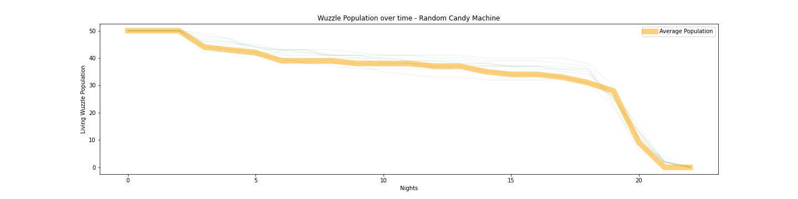
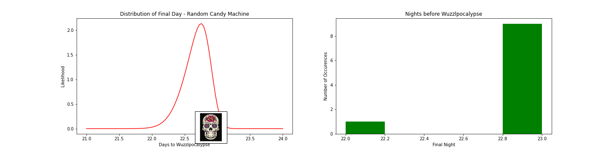
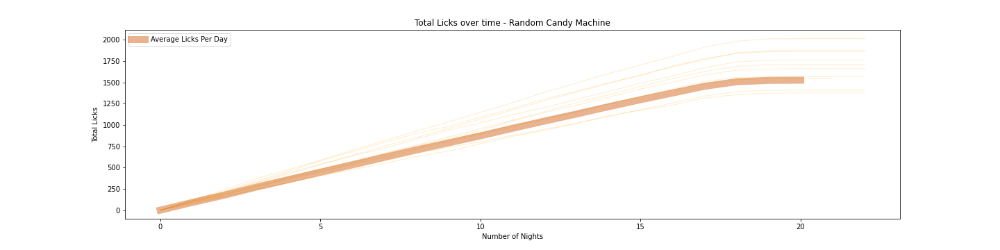
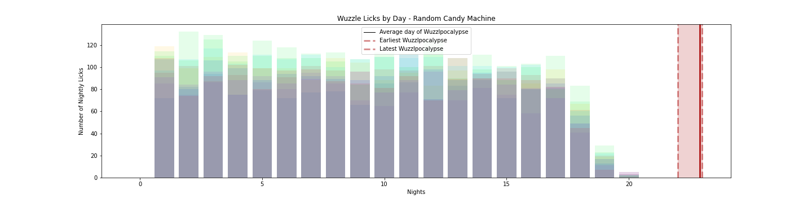
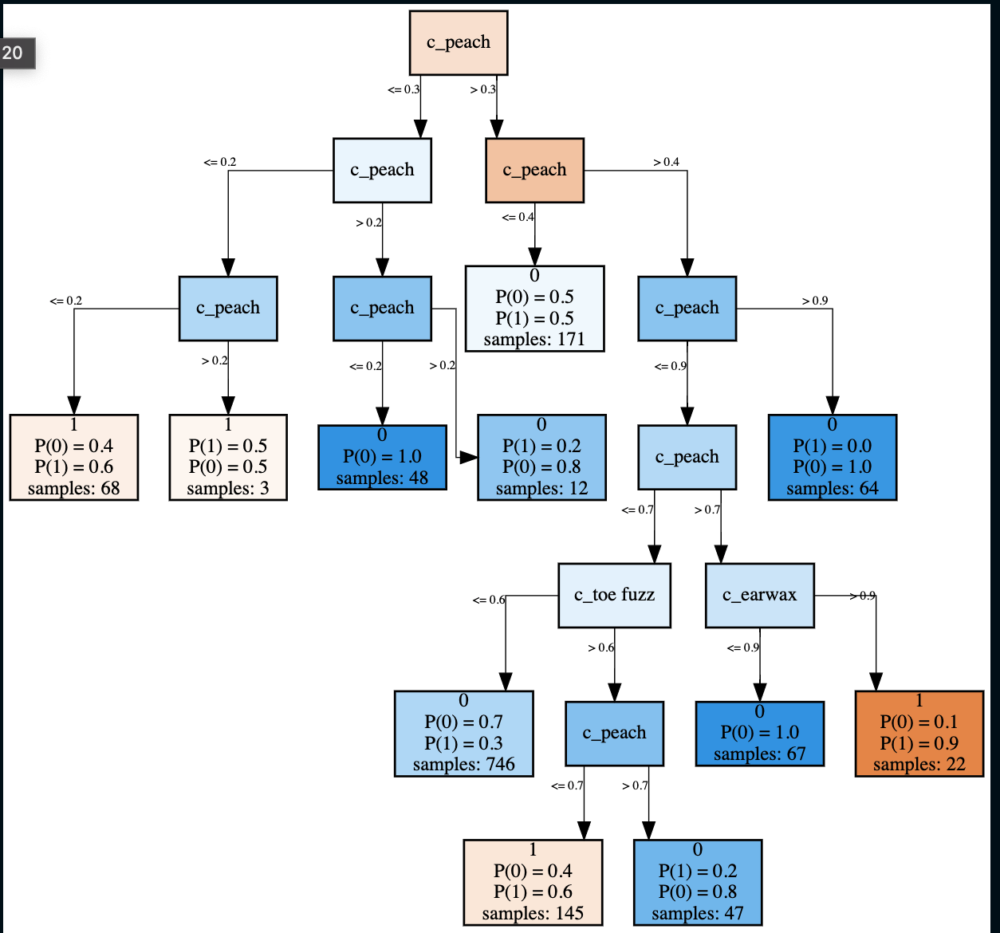
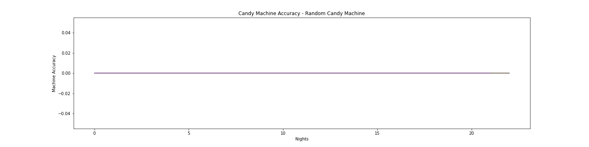
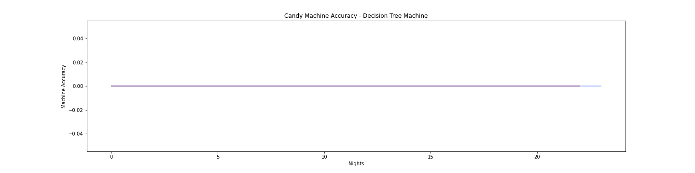

# The CANDY Machine
Welcome to the CANDY machine, a **reinforcement learning system** to solve an economic relationship between wuzzles and CANDY. I created a whimsical environment to develop the system, but this would be useful in a number of scenarios such as **adoption services, job matching, a recommendation system for perishable goods**, ***or other similar scenarios***. Wuzzles are just more fun and I'm off the clock.

# The Problem Set

The planet Wuzzlopolis has **two** **big** **problems**.

## Problem 1: The planet is full of hungry wuzzles. 

Traditionally the **Kind King** of Wuzzlopolis would feed each wuzzle by hand based on how much he liked each wuzzle and what the Kind King thought they would like. 

This approach wasn't the best, because the Kind King was only one Wuzzle and had only one perspective. One wuzzle can only do so much, and he could never pay attention to every wuzzle and what they liked to eat... he had to make a lot of generalizations and while doing the best he could, his choices were somewhat arbitrary.

Still, Wuzzlopolis did O.K. under the Kind King.

Unfortunately, **THE Kind King HAS DIED SUDDENLY** and there is nobody to replace them. 

Obviously we must build a machine to do his job.

We also kinda low-key hope that our machine is better at feeding Wuzzles than the Kind King. If our machine is smart enough, it will be able to track wuzzle preferences individually and keep them fed for as long as possible before the food supply runs out.

## Problem 2: Wuzzlopolis is full of uneaten CANDY.

One interesting thing about CANDY on Wuzzlopolis is that it is alive. 

CANDY individuals also like to be eaten. In fact they need to be eaten because when they aren't, CANDY gets very **depressed and moody** and doesn't enjoy life very much. It also **dies a horrible death** after a few days.

CANDY comes in many flavors, ranging from **[ 'apple' : 'earwax' ]** and a single CANDY can have multiple flavors (but not always).

Luckily **WUZZLES EAT CANDY**, but are very picky about which flavors of candy they eat.

Obviously we must build a machine to distribute CANDY individuals to the wuzzles.

If our machine is smart enough, it will track CANDY individuals and keep them alive as long as possible.

# Let us create a CANDY machine and feed wuzzles CANDY!

## Further notes about the rules of Wuzzlopolis environment

- Every wuzzle has a set of flavors they can eat, but can't eat other flavors. ['peach', 'tarball', 'toe fuzz']
- If a wuzzle doesn't eat, it has a chance of SUDDEN DEATH. Every day unfed increases the chance of SUDDEN DEATH.
- If a CANDY individual isn't eaten for a day, it has a chance of SUDDEN DEATH. Every day unlicked increases the chance of SUDDEN DEATH.
- Every wuzzle has his own CANDY cookbook with lists sorted by CANDY breed where CANDY individuals can be listed. Our machine will pick CANDY individuals based on what CANDY individuals are on each CANDY list.
- Every wuzzle owns a lunchbox that can have up to 20 CANDY. Our machine will load the lunchbox from the cook book.
- When we say a wuzzle eats a candy, it actually just **licks** it and tosses it back into the wild. That wuzzle will never lick it again, but other wuzzles can lick the same candy.

# More about the CANDY machine.

- Each wuzzle has a cookbook that is a collection of lists. These are effectively **queues** of CANDY individuals that could potentially be licked.
- Our machine will pick individuals from those queues to be **added** to this particular wuzzles lunchbox.
- The wuzzle will **open** the lunchbox each day and see if they like any of the CANDY. If they do, they will lick it... So the lunchbox must be refilled every day.
- Our machine will be using **reinforcement learning** to determine which queues and which particular candy to put in each lunchbox. It might get **rewards** when:
	- A wuzzle is fed
	- A CANDY is licked
	- A wuzzle makes it through the day, or possibly a score for wuzzles each day
	- A CANDY makes it through the day, or possibly a score for CANDY each day
- We should probably build a few machines and compare them with each other. So it should be fairly **modular**.

---

# Development Setup

The virtual environment was created with this, but you shouldn't have to run it. It was done using Python 3.8.6 installed via pyenv:

	python -m virtualenv .
	
Create the virtual environment:

	source bin/activate
	pip install -r requirements.txt
	
# Running Tests

Because we are working in a virtual env, pytest will need to be invoked with:

	python -m pytest
	

# Modeling

## Implementation of Random

The first task of this project was to implement the simulation itself and establish a baseline for what happens in an uncontrolled simulation. It was also necessary to gain insight into what happens during a simulation run.

So in the first notebook in the series, a random algorithm is used to establish a baseline for what happens when no intelligent routing of candy happens.

Much as we would expect, all the Wuzzles die. This is because the same Wuzzle cannot lick the same candy more than once, and there are never new candy introduced, so eventually all the Wuzzles starve to death.

I use the term "**Wuzzlpocalypse**" to represent the day that the last Wuzzle dies of starvation. In each simulation, the day is recorded and you can see a distribution of how long that takes in the graph below.

Next we can see the total number of licks that happen in each simulation as well as the mean of them. You can see that early on the number climbs quickly and as the candy supply diminishes, the number levels off and everyone dies.

Last, we look at licks per day. It is similar to the last graph, but focused on each day rather than a grand total for the simulation.

## Incremental Learning

Before building the reinforcement learning piece, it made sense to also implement an incrementally trained model to give me a chance to flesh out things like model persistence and further develop the simulation.

Incremental learning has a lot in common with the idea of reinforcement learning, so it made sense to go after those parts first. In order to accomplish this easily, I employed a python library called River.

**River**: River is a Python library for online machine learning. It is the result of a merger between creme and scikit-multiflow. River's ambition is to be the go-to library for doing machine learning on streaming data.

The first model I chose was a **Decision Tree** simply because of:

- Ease of implementation.
- Support for incremental training.

The way it works is via the check_menu() method in the Wuzzle class. Basically when a wuzzle looks at a candy on the menu, he decides wether to lick it or not. I attached this action to the train_one() method of the model and then persist the model to disk. 

Here is the breakdown of the first training:

### My hypothesis for this part of the project is that this model will actually be good at feeding the best candy to wuzzles. Unfortunately I think this will lead to initial gluttony followed by a faster starvation cycle and an EARLIER Wuzzlpocalypse... which is very bad for the Wuzzles.

## Let's find out:

It looks like, **yes**, the date for Wuzzlpocalypse is significantly moved up when we use the Decision Tree model. It looks like our tree is reasonably good at feeding wuzzles and letting the gluttonous little buggers eat themselves to death.

### Accuracy

Another thing we can look at is accuracy over time for each simulation.

Because of the non-deterministic nature of the random model and the structure of the code, Random starts at an artificially high accuracy rating. However over time, you can see it trend down towards an expected 50/50 accuracy. 

On the other hand the **tree** model quickly trains to an improved accuracy after a few nights and stays in that range. It is worth noting that it gets trained with every wuzzle looking at candy, so even by the end of the first night, it has had **(Number of Wuzzles x Number of Simulations)** of data points to train on. 

#TODO

- ask ryan what the fundamental difference is, if any between reinforcement learning and incremental learning .. or are they basically the same thing?
- revisit averages for graphs.. something is wrong there

# ***Future Considerations***:

	What if CANDY was actually wuzzles in disguise?
	What if wuzzles and CANDY can have **babies**?
	CANDY might lay eggs in wuzzle poop. We're not sure about that yet.
	What if a wuzzle can form a psychic chat-bond with a CANDY, and as long as it persists, the effects are mutually beneficial?
	What if Wuzzles could recycle candy after a certain amount of time, or have a % chance of a candy getting reset. If so, is there a population density that perpetuates Wuzzledom?

